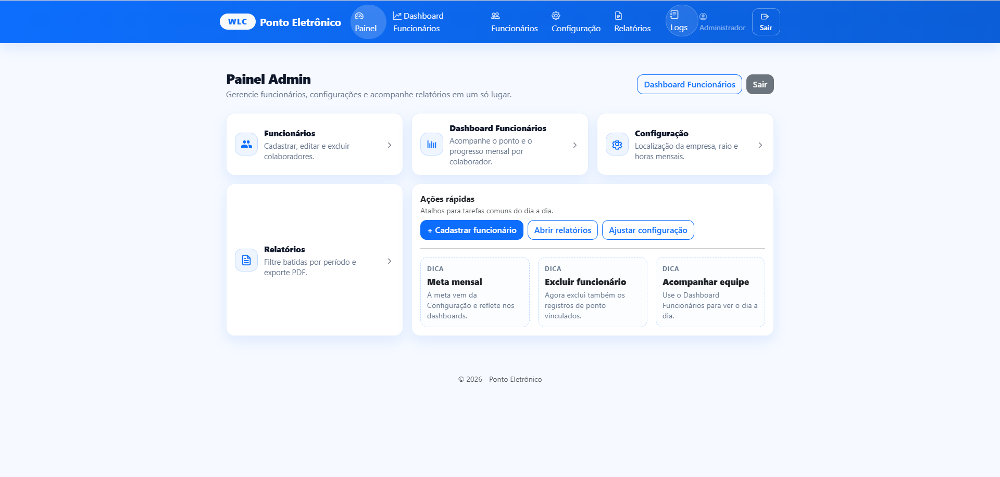
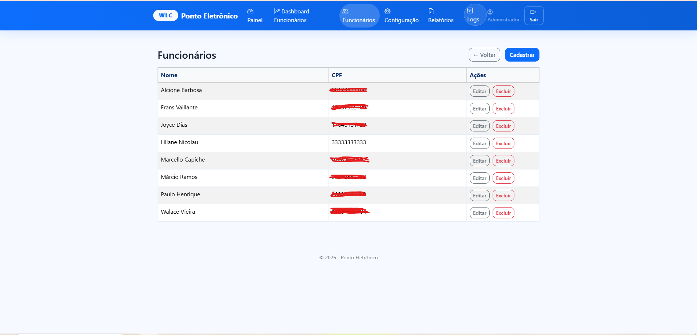
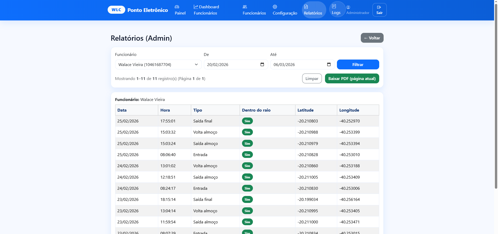

# Sistema de Ponto Eletrônico WLC

Sistema web de controle de ponto desenvolvido para pequenas e médias empresas, com foco em simplicidade, organização e acompanhamento administrativo.

## Visão geral

O sistema permite gerenciar funcionários, registrar ponto, acompanhar relatórios, visualizar dashboards e manter um histórico de alterações administrativas.

## Funcionalidades

- Cadastro de funcionários
- Login com perfis de acesso
- Registro de ponto
- Dashboard administrativo
- Dashboard por funcionário
- Relatórios por período
- Exportação em PDF
- Configuração de localização e horas mensais
- Logs de alterações administrativas

## Tecnologias utilizadas

- ASP.NET Core 8
- C#
- Entity Framework Core
- SQL Server
- Bootstrap 5
- Chart.js
- Azure App Service

## Demonstração visual

### Painel administrativo

### Cadastro de funcionários

### Dashboard

### Relatórios

### Logs

## Modelo de uso

Este sistema está disponível para locação/implantação para empresas.

## Importante

Este repositório tem finalidade de apresentação de portfólio e demonstração visual do sistema.

O código-fonte completo não está disponível publicamente.

## Contato

Interessados em demonstração, implantação ou locação podem entrar em contato.

- Nome: Walace Vieira
- LinkedIn: www.linkedin.com/in/walace-vieira-80472727b
- WhatsApp: 27 98843-3016

- E-mail: walaceleoric@gmail.com

